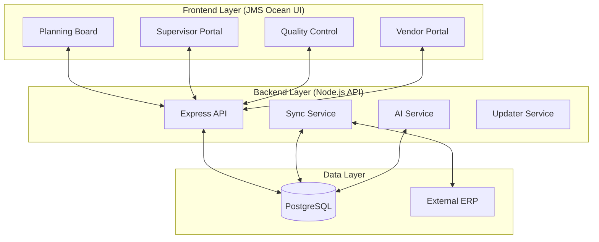
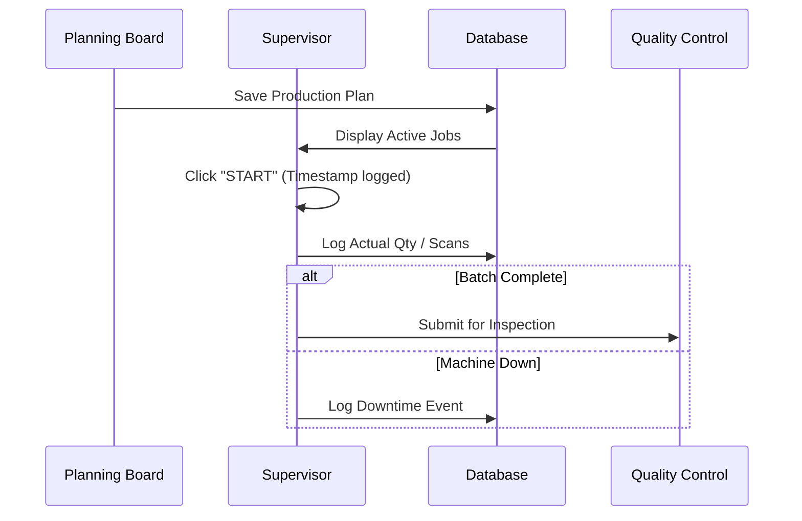

# 🌊 JMS Ocean: Best Workflow Design & System Architecture

This document outlines the core technical design, operational workflows, and "Best-in-Class" manufacturing architecture of the **JMS Ocean** (JMS Manufacturing System).

---

## 🏗️ System Architecture

JMS Ocean is built on a high-availability, service-oriented architecture tailored for real-time manufacturing execution.

---

## 👥 Role-Based Workflow Design

### 1. 🎯 Strategic Planning (Superadmin)
**File**: `public/planning.html`
The Planning Board is the "Brain" of JMS Ocean. It transforms high-level ERP orders into granular machine-level sequences.

**Workflow Logic**:
1. **Fetch**: Latest orders from ERP via `sync.service.js`.
2. **Assign**: Drag-and-drop orders to specific Production Lines/Machines.
3. **Sequence**: Optimize the "Seq" (Sequence) for minimum changeover time.
4. **Publish**: Plans become visible to Supervisors in real-time.

---

### 2. ⚡ Execution & Production (Supervisor)
**File**: `public/supervisor.html`
A touch-optimized interface for the factory floor.

**The "Best Workflow" Cycle**:

---

### 3. ✅ Quality Assurance (QC)
**File**: `public/Quality.html` / `QCSupervisor.html`
Ensures that "JMS Ocean" standards are met before goods leave the floor.

---

## 🧠 Advanced Services

### 🔄 Sync Service (`sync.service.js`)
Maintains a perfect mirror of the ERP data.
- **Auto-Sync**: Background polling every X minutes.
- **Conflict Resolution**: Ensures manual planning overrides aren't lost during ERP updates.

### 🤖 AI Service (`ai.service.js`)
Provides intelligent insights and optimization for the manufacturing process.
- **Predictive Planning**: Suggests optimal machine assignments based on historical performance.
- **Anomaly Detection**: Flags unusual production patterns or excessive downtime.

---

## 🛠️ Deployment & Maintenance

JMS Ocean uses PM2 Cluster Mode for zero-downtime updates.

| Action | Command | Tool |
| :--- | :--- | :--- |
| **Start/Monitor** | `pm2 start ecosystem.config.js` | PM2 |
| **Backup DB** | `node scripts/create_full_backup.js` | Custom Script |
| **Update** | `powershell ./deploy_v11.ps1` | deployment script |

---

> [!TIP]
> **JMS Ocean** is optimized for low-latency updates. Use the `sync_monitor.html` to track real-time health of the data bridge.
